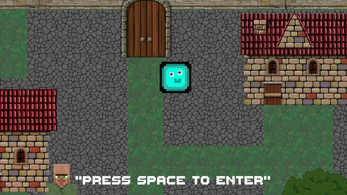

# MUJ - My Unity Game
Embark on a journey with MUJ, a Unity-based adventure that marks my inaugural foray into game development.

 

# Game Objectives:

## Core Gameplay:
Complete a series of three engaging tasks designed to test your agility and problem-solving skills.
## 1st Task: Dinosaur Dash

Navigate through a prehistoric terrain, avoiding obstacles such as cacti and birds to reach the formidable dinosaur awaiting at the trail's end.
### Game Controls:
Jump: Spacebar
Duck: Down Arrow Key
## 2nd Task: Snake

Traverse the labyrinth, consuming all the bait scattered throughout to progress.
### Game Controls:
Movement: Arrow Keys
## 3rd Task: Flappy Bird

Guide your bird through a treacherous maze of pipes, aiming to complete the map unscathed.
### Game Controls:
Flap/Jump: Spacebar
#Seize the opportunity to experience MUJ by downloading it from MUJ_setup.rar
# Discover more about MUJ and engage with the community at "https://yigitisikci.itch.io/muj"
